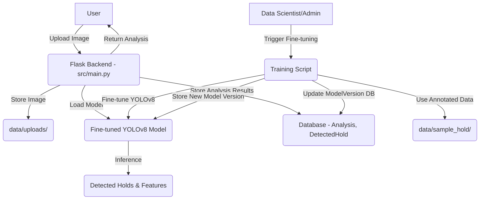

# Week 3-4 Implementation Plan: Hold Detection Fine-tuning and Basic Analysis Endpoint

This document outlines the technical implementation plan for Week 3-4 features, focusing on fine-tuning the hold detection model and developing a basic analysis endpoint.

## 1. Architecture Overview

The existing application is a Flask-based web service (`src/main.py`) that uses a pre-trained YOLOv8 model (`yolov8n.pt`) for hold detection. The database schema is defined in `src/models.py`.

The proposed architecture will extend the existing system by:

- Adding a training pipeline for fine-tuning the YOLOv8 model on custom bouldering hold datasets.
- Enhancing the `src/models.py` to manage multiple versions of trained models.
- Modifying `src/main.py` to allow the loading and use of different model versions, as well as introducing a new API endpoint for image analysis.



## 2. Hold Detection Model Fine-tuning Plan

### 2.1. Dataset Preparation Approach

- **Existing Data Directories**: The `data/sample_hold/` directory is identified for storing bouldering-specific annotated hold data. This directory should contain images and corresponding YOLO-format annotation files (`.txt`).
- **Data Augmentation**: Implement basic data augmentation techniques (e.g., random flips, rotations, scaling, brightness adjustments) during training to improve model robustness and generalization.
- **Data Split**: The dataset will be split into training, validation, and test sets. A typical split of 80% training, 10% validation, and 10% testing will be used.

### 2.2. YOLOv8 Fine-tuning Methodology and Configuration

- **Base Model**: Continue to leverage the `yolov8n.pt` pre-trained model.
- **Framework**: Utilize the Ultralytics YOLOv8 library within PyTorch.
- **Fine-tuning Strategy**:
  - **Transfer Learning**: Freeze initial layers and train only the head of the network for a few epochs.
  - **Full Fine-tuning**: Unfreeze all layers and fine-tune the entire network with a smaller learning rate.
- **Configuration**:
  - **Model Architecture**: YOLOv8-nano (`n`) will be used as the base.
  - **Optimizer**: Adam or SGD with momentum.
  - **Learning Rate Schedule**: Cosine annealing or ReduceLROnPlateau.
  - **Batch Size**: Determined by available GPU memory.
  - **Epochs**: Initially, a small number of epochs (e.g., 50-100) for transfer learning, followed by more epochs (e.g., 100-200) for full fine-tuning.

### 2.3. Training Pipeline Design

- **Script**: A dedicated Python script (e.g., `src/train_model.py`) will be created to manage the fine-tuning process.
- **Parameters**: The script will accept parameters such as:
  - `model_name`: Name for the new model version.
  - `epochs`: Number of training epochs.
  - `batch_size`: Batch size for training.
  - `data_yaml`: Path to the YOLO dataset configuration file (defining image paths, class names).
  - `weights`: Path to initial weights (e.g., `yolov8n.pt`).
- **Validation**:
  - Evaluate the model on the validation set after each epoch.
  - Save the best-performing model based on mAP (mean Average Precision).
- **Logging**: Log training metrics (loss, mAP, recall, precision) to a file or a specialized ML experiment tracking tool (e.g., MLflow if integrated later).

### 2.4. Model Versioning Strategy

- **Database Storage**: The `ModelVersion` table in `src/models.py` will be used to track model metadata, including `model_type`, `version`, `model_path`, `accuracy`, and `is_active`.
- **Model Storage**: Trained `.pt` model files will be stored in a dedicated directory (e.g., `models/hold_detection/`). The `model_path` in the database will point to this file.
- **Activation**: A mechanism will be implemented (e.g., an API endpoint or a configuration update) to mark a specific model version as `is_active=True` for inference. Only one model of a given `model_type` should be active at any time.

### 2.5. Confidence Thresholding Implementation

- **Configuration**: The confidence threshold will be a configurable parameter, potentially stored in `src/cfg/user_config.yaml` or fetched from the active `ModelVersion` entry.
- **Application**: During inference, only detections with a confidence score above this threshold will be considered valid. This will be applied in the `analyze_image` function in `src/main.py`.

## 3. Basic Analysis Endpoint Design

### 3.1. API Specification for POST `/analyze`

- **Endpoint**: `POST /analyze`
- **Description**: Uploads an image, performs hold detection and route grading, and returns the analysis results.
- **Authentication**: (To be considered in future phases, currently open)

### 3.2. Request/Response Schema

- **Request**:
  - `multipart/form-data` with a `file` field containing the image.
- **Response (200 OK)**:

    ```json
    {
      "analysis_id": "string (UUID)",
      "predicted_grade": "string (e.g., 'V3')",
      "confidence": "float (average confidence of detected holds)",
      "image_url": "string (URL to the uploaded image)",
      "holds": [
        {
          "type": "string (e.g., 'crimp')",
          "confidence": "float",
          "bbox": {
            "x1": "float",
            "y1": "float",
            "x2": "float",
            "y2": "float"
          }
        }
      ],
      "features": {
        "total_holds": "integer",
        "hold_types": {
          "crimp": "integer",
          "jug": "integer",
          // ... other hold types
        },
        "average_confidence": "float"
      }
    }
    ```

- **Error Response (400 Bad Request / 500 Internal Server Error)**:

    ```json
    {
      "error": "string (error message)"
    }
    ```

### 3.3. Image Preprocessing Pipeline

- **Libraries**: Pillow or OpenCV will be used for image processing. The existing `PIL.Image` usage in `src/main.py` is sufficient.
- **Steps**:
    1. **Loading**: Load the image from the uploaded file.
    2. **Resizing**: Resize the image to a standard input size required by the YOLOv8 model (e.g., 640x640). This is handled implicitly by `hold_detection_model(img)` in YOLOv8, but explicit resizing could be added for consistency if needed.
    3. **Normalization**: YOLOv8 models typically handle normalization internally, but verify if any explicit normalization (e.g., pixel value scaling) is required based on the fine-tuning process. The current `img.convert("RGB")` is a good start.

### 3.4. Model Inference Workflow

- The `analyze_image` function in `src/main.py` currently performs inference. This function will be enhanced to:
    1. Load the *active* hold detection model version using the `ModelVersion` table.
    2. Apply the configured confidence threshold to filter raw detection results.
    3. Call existing `_process_detection_results`, `predict_grade`, `_create_database_records`, and `_format_holds_for_response` functions.

### 3.5. Error Handling and Validation

- **File Upload Validation**: Ensure `allowed_file` checks are robust for image types.
- **Model Loading Errors**: Handle cases where the active model cannot be loaded (e.g., file not found, corrupt model).
- **Database Errors**: Implement proper error handling for SQLAlchemy operations, including rollbacks.
- **API Response**: Consistent error response format (`{"error": "message"}`).

## 4. Integration Strategy

### 4.1. Modifying `src/models.py`

- The `ModelVersion` table already exists and is suitable for tracking fine-tuned models. No major schema changes are required for this table.

### 4.2. Enhancing `src/main.py`

- **Model Loading**: Modify the model loading logic to:
  - Query the `ModelVersion` table to find the `is_active=True` model for `model_type='hold_detection'`.
  - Load the model weights from the `model_path` specified in the active `ModelVersion` record.
  - If no active model is found, fall back to `yolov8n.pt` or raise an error.
- **`analyze_image` Function Update**:
  - Pass the confidence threshold (from `user_config.yaml` or `ModelVersion`) to the detection step.
  - Integrate the confidence threshold filtering into `_process_detection_results` or immediately after `hold_detection_model(img)`.
- **New Training Endpoint (Optional, for admin use)**: Consider a protected endpoint (`POST /train`) or a separate CLI script (`src/train_model.py`) to trigger fine-tuning, save new model versions, and update the `ModelVersion` table. The CLI script approach is preferred for an initial implementation to keep the web API lean.

### 4.3. Configuration Updates Needed in `user_config.yaml`

- The `src/cfg/user_config.yaml` file (currently empty) will be used to store application-wide configurations, including:
  - `model_defaults.hold_detection_confidence_threshold`: Default confidence threshold for detections.
  - `model_paths.base_yolov8`: Path to the base `yolov8n.pt` model.
  - `data_paths.hold_dataset`: Path to the directory containing hold detection training data.

### 4.4. Database/Storage Requirements for Model Versions

- **ModelVersion Table**: As noted, this table is already in place. It will store:
  - `id`, `model_type` (e.g., 'hold_detection'), `version` (e.g., '1.0', '1.1'), `model_path` (e.g., 'models/hold_detection/v1.0.pt'), `accuracy`, `created_at`, `is_active`.
- **File System**:
  - `models/hold_detection/`: A new directory to store fine-tuned YOLOv8 model `.pt` files.
  - `data/sample_hold/`: Ensure this directory is properly structured for YOLO training (images and labels).

## 5. Testing Strategy

### 5.1. Unit Tests for Model Fine-tuning

- **`src/train_model.py` (if created)**:
  - Test dataset loading and augmentation.
  - Test model saving and loading functionalities.
  - Validate logging of training metrics.
  - Mock YOLOv8 training calls to ensure correct parameter passing.
- **Model Versioning Logic**:
  - Test `ModelVersion` database interactions (creating, activating, deactivating).
  - Ensure only one model of a given type can be active at a time.

### 5.2. Integration Tests for Analysis Endpoint

- **`POST /analyze`**:
  - Test with valid image uploads, verifying correct JSON response format and data.
  - Test with invalid file types.
  - Test with large files exceeding `MAX_CONTENT_LENGTH`.
  - Verify that detected holds are correctly filtered by the confidence threshold.
  - Check that analysis results are correctly stored in the `Analysis` and `DetectedHold` tables.
  - Use a mock or pre-loaded active model for consistent testing.

### 5.3. Test Data Requirements

- **Annotated Images**: A small set of diverse annotated bouldering images in `data/sample_hold/` for fine-tuning unit and integration tests.
- **Sample Images for Analysis**: Representative images for `POST /analyze` endpoint testing, including images with varying numbers and types of holds.
- **Database Fixtures**: Use `conftest.py` in `tests/` to set up and tear down a test database, pre-populate `HoldType` and `ModelVersion` (with an active hold detection model) data.

## 6. Implementation Steps

1. **Refactor Model Loading in `src/main.py`**:
    - Create a function to load the active hold detection model based on `ModelVersion` table.
    - Update the `hold_detection_model` initialization to use this function.
    - Implement fallback to `yolov8n.pt` if no active model is found.

2. **Create `src/cfg/user_config.yaml` and load configuration**:
    - Define default `hold_detection_confidence_threshold` and `model_paths.base_yolov8`, `data_paths.hold_dataset`.
    - Implement a utility function to load configuration from this YAML file.

3. **Enhance `analyze_image` in `src/main.py`**:
    - Integrate confidence thresholding from the loaded configuration or active model version during detection processing.

4. **Develop `src/train_model.py` (Training Script)**:
    - Implement script for YOLOv8 fine-tuning.
    - Include data loading, augmentation, training loop, validation, and best model saving.
    - Add functionality to save trained models to `models/hold_detection/` and create new entries in `ModelVersion` table.

5. **Implement Model Activation/Deactivation Logic**:
    - Consider a CLI command or a simple function in `src/models.py` to activate/deactivate model versions in the database.

6. **Update `tests/`**:
    - Write unit tests for the new model loading logic and confidence thresholding.
    - Write integration tests for `POST /analyze` endpoint with the updated model loading and inference.
    - Create test fixtures for `ModelVersion` data.

7. **Review and Refine**:
    - Ensure all new components are well-documented.
    - Conduct code reviews.
